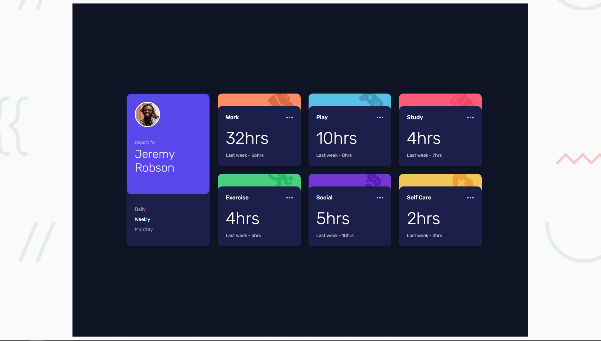
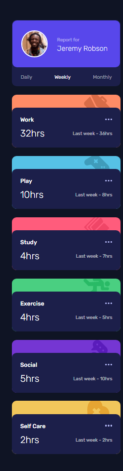

# Frontend Mentor - Time tracking dashboard solution

This is a solution to the [Time tracking dashboard challenge on Frontend Mentor](https://www.frontendmentor.io/challenges/time-tracking-dashboard-UIQ7167Jw). Frontend Mentor challenges help you improve your coding skills by building realistic projects. 

## Table of contents

- [Overview](#overview)
  - [The challenge](#the-challenge)
  - [Screenshots](#screenshots)
  - [Link](#link)
- [My process](#my-process)
  - [Built with](#built-with)
  - [What I learned](#what-i-learned)
  - [Continued development](#continued-development)
- [Author](#author)
- [Acknowledgments](#acknowledgments)

**Note: Delete this note and update the table of contents based on what sections you keep.**

## Overview

### The challenge

Users should be able to:

- View the optimal layout for the site depending on their device's screen size
- See hover states for all interactive elements on the page
- Switch between viewing Daily, Weekly, and Monthly stats

### Screenshots

### Link

- Solution URL: [Add solution URL here](https://github.io/time-tracking-frontend-mentor)

## My process

### Built with

- Semantic HTML5 markup
- CSS custom properties
- Flexbox
- CSS Grid
- Mobile-first workflow
- JS - JSON - fetch API

### What I learned

- Practiced CSS variables, backgrounds, SVG
- Practiced JS, JSON via fetch API, conditional rendering in loops, via mapping arrays

### Continued development

Need to continue practicing conditional rendering when rendering data from API or complex structures

## Author

- Website - [Add your name here](https://adinicarel.netlify.app)
- Frontend Mentor - [@yourusername](https://www.frontendmentor.io/profile/adinicarel)
- Github - [@adinicarel](https://www.github.com/adinicarel)